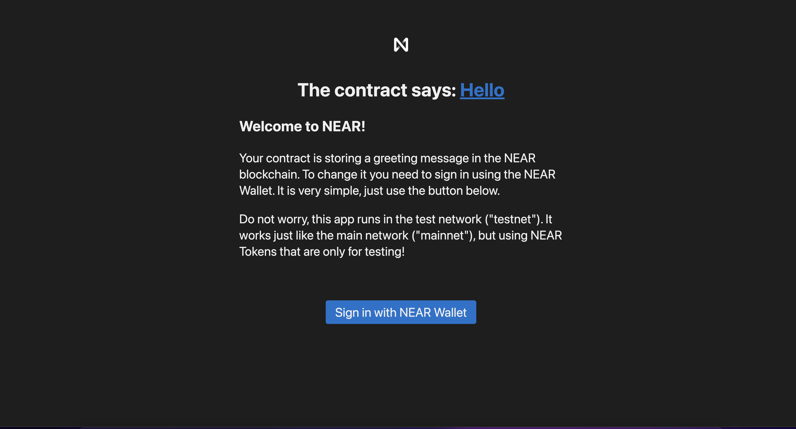
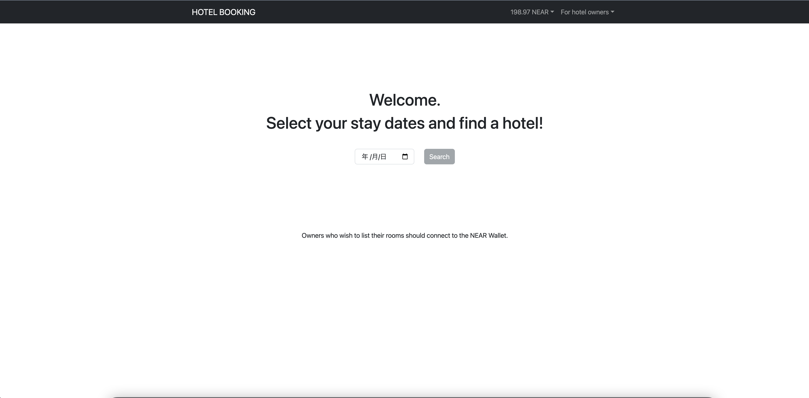

# NearDApp
Nearと連動するDApp開発用のリポジトリです。

## Near protocolとは
Near protocolは、シャーディングと呼ばれる技術を採用してるPoSパブリックプロコトルでETHなどと同じレイヤー1と呼ばれるブロックチェーン。  

また、Near protocolではETHと競合関係にありがならETHと互換性をもたせるために「Rainbowbridge」というサービスも提供してます。
  
これを利用することでNEAR⇔ETHの移動ができるようになり、ETHをメインに利用している人でも気軽にNEARネットワークを使用することが可能になりました。

### BlockExplorer

 [テストネットへのデプロイ例](https://explorer.testnet.near.org/transactions/GKapRwXm8uUs3Lf1jMNf9cPURdnoEg5G2uiDkE1brzwx)

### Near CLIのインストールコマンド
 `npm i -g near-cli`  
 `near`

### プロジェクトの雛形作成コマンド例
 `npx create-near-app --frontend=react --contract=rust --tests rust near-hotel-booking-dapp`  

 コマンドのオプションは必ず指定すること！！!!
 下記のようなエラーが出てくる。

 ```cmd
Arguments error
Run npx create-near-app without arguments, or use:
npx create-near-app <projectName> --contract rust|js|assemblyscript --frontend react|vanilla|none --tests js|rust
 ```

うまく行けば、下記のような内容が出力される。
```cmd
======================================================
👋 Welcome to NEAR! Learn more: https://docs.near.org/
🔧 Let's get your dApp ready.
======================================================
(NEAR collects anonymous information on the commands used. No personal information that could identify you is shared)


Creating a new NEAR dApp

======================================================
✅  Success! Created '/Users/harukikondo/git/NearDApp/near-hotel-booking-dap'
   with a smart contract in Rust and a frontend template in React.js.
🦀 If you are new to Rust please visit https://www.rust-lang.org 

  Your next steps:
   - Navigate to your project:
         cd /Users/harukikondo/git/NearDApp/near-hotel-booking-dap
   - Install all dependencies
         npm run deps-install
   - Test your contract in NEAR SandBox:
         npm test
   - Deploy your contract to NEAR TestNet with a temporary dev account:
         npm run deploy
   - Start your frontend:
         npm start
```

### テスト実行方法1

`npm test`

```cmd
 Passed ✅ gets default message
 Passed ✅ changes message
```

### テスト実行方法2

`cd contract`  
`cargo test` 

うまく行けば下記の様に出力される。  

```cmd
    Blocking waiting for file lock on package cache
    Blocking waiting for file lock on build directory
   Compiling hotel_booking v1.0.0 (/Users/harukikondo/git/NearDApp/near-hotel-booking-dapp/contract)
    Finished test [unoptimized + debuginfo] target(s) in 1m 10s
     Running unittests src/lib.rs (target/debug/deps/hotel_booking-6485072b7a754368)

running 5 tests
test tests::no_available_room ... ok
test tests::no_registered_room ... ok
test tests::add_then_get_available_rooms ... ok
test tests::add_then_get_registered_rooms ... ok
test tests::book_room_then_change_status ... ok

test result: ok. 5 passed; 0 failed; 0 ignored; 0 measured; 0 filtered out; finished in 0.00s

   Doc-tests hotel_booking

running 0 tests

test result: ok. 0 passed; 0 failed; 0 ignored; 0 measured; 0 filtered out; finished in 0.00s
```

### コントラクトをビルドする方法2

`cd contract`  
`cargo build --target wasm32-unknown-unknown --release`  

#### ビルドファイルが生成されているか確認する方法  
`ls ./target/wasm32-unknown-unknown/release | grep hotel_booking.wasm`  

#### Near Walletへログインするコマンド  

`near login`  

#### サブアカウントを作成するコマンド  
`near create-account contract.dev-1660204085773-49134722844982 --masterAccount dev-1660204085773-49134722844982 --initialBalance 5`   

もしうまくアカウントが作成できていれば`~/.near-credentials/testnet`フォルダ配下にアカウント情報(jsonファイル形式)が出力されているはずです。

#### サブアカウントを作成するコマンド(例)
`near create-account booking1.dev-1660204085773-49134722844982 --masterAccount dev-1660204085773-49134722844982 --initialBalance 5`  
`near create-account booking2.dev-1660204085773-49134722844982 --masterAccount dev-1660204085773-49134722844982 --initialBalance 5`

#### サブアカウントを削除するコマンド  

`near delete contract.dev-1660204085773-49134722844982 dev-1660204085773-49134722844982`

#### スマートコントラクトをデプロイするコマンド  
`near deploy --wasmFile target/wasm32-unknown-unknown/release/hotel_booking.wasm --accountId contract.dev-1660204085773-49134722844982`  

うまく行けば下記のような内容が出力される。

```cmd
Starting deployment. Account id: contract.dev-1660204085773-49134722844982, node: https://rpc.testnet.near.org, helper: https://helper.testnet.near.org, file: target/wasm32-unknown-unknown/release/hotel_booking.wasm
Transaction Id 5hr8mjNtk2gwiDp4qezbV3dksQgYk8WRXV5fCLQ1PSri
To see the transaction in the transaction explorer, please open this url in your browser
https://explorer.testnet.near.org/transactions/5hr8mjNtk2gwiDp4qezbV3dksQgYk8WRXV5fCLQ1PSri
Done deploying to contract.dev-1660204085773-49134722844982
```

#### スマートコントラクトのメソッドをコマンドで呼び出す方法(viewメソッド)   

`near view contract.dev-1660204085773-49134722844982 get_rooms_registered_by_owner '{"owner_id": "dev-1660204085773-49134722844982"}' --accountId dev-1660204085773-49134722844982`

うまく行けば下記のように出力される。  

```cmd
View call: contract.dev-1660204085773-49134722844982.get_rooms_registered_by_owner({"owner_id": "dev-1660204085773-49134722844982"})
[]
```

#### Room情報を追加するためのcallメソッドを呼び出すコマンドは次の通り  

`near call contract.dev-1660204085773-49134722844982 add_room_to_owner '{"name": "Sun Room", "image": "https://ibb.co/kgNm4jP", "beds": 1, "description": "This is Sun room.", "location": "Tokyo", "price": "1000000000000000000000000"}' --accountId dev-1660204085773-49134722844982`  

成功していれば、viewメソッドを呼び出した時に次の内容が出力される。

```cmd
View call: contract.dev-1660204085773-49134722844982.get_rooms_registered_by_owner({"owner_id": "dev-1660204085773-49134722844982"})
[
  {
    name: 'Sun Room',
    image: 'https://ibb.co/kgNm4jP',
    beds: 1,
    description: 'This is Sun room.',
    location: 'Tokyo',
    price: '1000000000000000000000000',
    status: 'Available'
  }
]
```

#### existsメソッドを呼び出すコマンド  

`near view contract.dev-1660204085773-49134722844982 exists '{"owner_id": "dev-1660204085773-49134722844982", "room_name": "Sun Room"}' --accountId dev-1660204085773-49134722844982`

#### get_available_roomsメソッドを呼び出すコマンド

`near call booking1.dev-1660204085773-49134722844982 get_available_rooms '{"room_id": "dev-1660204085773-49134722844982Sun Room", "check_in_date": "2222-01-01"}' --accountId dev-1660204085773-49134722844982`

レスポンス例
```json
[
  {
    room_id: 'dev-1660204085773-49134722844982Sun Room',
    owner_id: 'dev-1660204085773-49134722844982',
    name: 'Sun Room',
    image: 'https://ibb.co/kgNm4jP',
    beds: 1,
    description: 'This is Sun room.',
    location: 'Tokyo',
    price: '1000000000000000000000000'
  }
]
```

#### book_roomメソッドを呼び出すコマンド

`near call booking1.dev-1660204085773-49134722844982 book_room '{"room_id": "dev-1660204085773-49134722844982Sun Room", "check_in_date": "2222-01-01"}' --depositYocto=1000000000000000000000000 --accountId booking2.dev-1660204085773-49134722844982`

#### ownerが予約データを確認するためのコマンド

`near view booking1.dev-1660204085773-49134722844982 get_booking_info_for_owner '{"owner_id":"dev-1660204085773-49134722844982"}'`  

レスポンス結果
```json
[
  {
    room_id: 'dev-1660204085773-49134722844982Sun Room',
    name: 'Sun Room',
    check_in_date: '2222-01-01',
    guest_id: 'booking2.dev-1660204085773-49134722844982',
    status: 'Available'
  }
]
```

#### 宿泊者が自らの予約データを確認するコマンド

`near view booking1.dev-1660204085773-49134722844982 get_booking_info_for_guest '{"guest_id": "booking2.dev-1660204085773-49134722844982"}'`  

レスポンス結果
```json
[
  {
    owner_id: 'dev-1660204085773-49134722844982',
    name: 'Sun Room',
    check_in_date: '2222-01-01'
  }
]
```

#### チェックインを行うためのコマンド

`near call booking1.dev-1660204085773-49134722844982 change_status_to_stay '{"room_id": "dev-1660204085773-49134722844982Sun Room", "check_in_date": "2222-01-01"}' --accountId dev-1660204085773-49134722844982`

#### チェックアウトを行うためのコマンド

`near call booking1.dev-1660204085773-49134722844982 change_status_to_available '{"room_id": "dev-1660204085773-49134722844982Sun Room", "check_in_date": "2222-01-01", "guest_id": "booking2.dev-1660204085773-49134722844982"}' --accountId dev-1660204085773-49134722844982`  

このコマンドを実行した後に予約データを取得するメソッドを打ち込んで[]が返ってきていれば成功!!

### テストネットへのデプロイ方法

`npm run deploy`

```cmd
 near-hotel-booking-dap@1.0.0 deploy
> npm run build:contract && cd contract && near dev-deploy --wasmFile ./target/wasm32-unknown-unknown/release/hello_near.wasm


> near-hotel-booking-dap@1.0.0 build:contract
> cd contract && rustup target add wasm32-unknown-unknown && cargo build --all --target wasm32-unknown-unknown --release

info: component 'rust-std' for target 'wasm32-unknown-unknown' is up to date
    Finished release [optimized] target(s) in 0.88s
Please help us to collect data on near-cli usage to improve developer experience. 
We will never send private information. We collect which commands are run with attributes, your account ID, and your country
Note that your account ID and all associated on-chain transactions are already being recorded on public blockchain. 

Would you like to opt in (y/n)? y
Starting deployment. Account id: dev-1660204085773-49134722844982, node: https://rpc.testnet.near.org, helper: https://helper.testnet.near.org, file: ./target/wasm32-unknown-unknown/release/hello_near.wasm
Transaction Id GKapRwXm8uUs3Lf1jMNf9cPURdnoEg5G2uiDkE1brzwx
To see the transaction in the transaction explorer, please open this url in your browser
https://explorer.testnet.near.org/transactions/GKapRwXm8uUs3Lf1jMNf9cPURdnoEg5G2uiDkE1brzwx
Done deploying to dev-1660204085773-49134722844982
```

### レッスン2時点でのデプロイ記録

```cmd
 near-hotel-booking-dap@1.0.0 deploy
> npm run build:contract && cd contract && near dev-deploy --wasmFile ./target/wasm32-unknown-unknown/release/hello_near.wasm


> near-hotel-booking-dap@1.0.0 build:contract
> cd contract && rustup target add wasm32-unknown-unknown && cargo build --all --target wasm32-unknown-unknown --release && cp ./target/wasm32-unknown-unknown/release/hotel_booking.wasm ../out/main.wasm

info: component 'rust-std' for target 'wasm32-unknown-unknown' is up to date
    Finished release [optimized] target(s) in 1.22s
Starting deployment. Account id: dev-1660204085773-49134722844982, node: https://rpc.testnet.near.org, helper: https://helper.testnet.near.org, file: ./target/wasm32-unknown-unknown/release/hello_near.wasm
Transaction Id DvxxTXK28ncnM4FUo4ZFvjvTYanijGTGEmcSoEQVma9B
To see the transaction in the transaction explorer, please open this url in your browser
https://explorer.testnet.near.org/transactions/DvxxTXK28ncnM4FUo4ZFvjvTYanijGTGEmcSoEQVma9B
Done deploying to dev-1660204085773-49134722844982
```

### フロントエンド起動方法

`npm start`  



### Nrtlifyでデプロイする方法

1. `netlify login`
2. `netlify deploy --prod`  

CLI形式でいくつか質問されるので自分のプロジェクトにあう様に回答していく。  
うまく行けば下記の様な内容が出力される。 

```cmd
This folder isn't linked to a site yet
? What would you like to do? +  Create & configure a new site
? Team: mashharuki
Choose a unique site name (e.g. netlify-thinks-mashharuki-is-great.netlify.app) or leave it blank for a random name. You can update the site name later.
? Site name (optional): naer-hotel-booking-dapp

Please provide a publish directory (e.g. "public" or "dist" or "."):
/Users/harukikondo/git/NearDApp/near-hotel-booking-dapp
? Publish directory /Users/harukikondo/git/NearDApp/near-hotel-booking-dapp/frontend/dist
Deploy path:        /Users/harukikondo/git/NearDApp/near-hotel-booking-dapp/frontend/dist
Configuration path: /Users/harukikondo/git/NearDApp/near-hotel-booking-dapp/netlify.toml
Deploying to main site URL...
✔ Finished hashing 
✔ CDN requesting 7 files
✔ Finished uploading 7 assets
✔ Deploy is live!

Logs:              https://app.netlify.com/sites/naer-hotel-booking-dapp/deploys/62f71bc5b952c7553dfddd1f
Unique Deploy URL: https://62f71bc5b952c7553dfddd1f--naer-hotel-booking-dapp.netlify.app
Website URL:       https://naer-hotel-booking-dapp.netlify.app
```

うまく行けば、Webに公開されてローカルにデプロイした時と同じ様にアクセスすることができる!! 



##### ============================================

### 参考文献
1. [Create Near AppのNPMページ](https://www.npmjs.com/package/create-near-app?activeTab=readme)
2. [BlockExplorer](https://explorer.testnet.near.org/)
3. [Nearprotocolの開発者ドキュメント](https://docs.near.org/develop/quickstart-guide)
4. [Near SDK](https://docs.rs/near-sdk/latest/near_sdk/)
5. [【NEAR編】NEAR Walletの作成から購入方法。Rainbow bridgeでのブリッジ方法も徹底解説](https://koji-toku.com/near-wallet-bridge)
6. [BlockExplorer(mashharuki.testnet)](https://wallet.testnet.near.org/profile/mashharuki.testnet)
7. [NearWalletPortal](https://wallet.near.org/)
8. [NearUniversityJapan](https://near-university-japan.super.site/)
9. [booking1.dev-1660204085773-49134722844982 Contract](https://explorer.testnet.near.org/accounts/booking1.dev-1660204085773-49134722844982)
10. [ReactBootStrap](https://react-bootstrap.netlify.app/components/buttons/#rb-docs-content)
11. [Netlify](https://www.netlify.com/)
12. [near-hotel-booking-dapp](https://naer-hotel-booking-dapp.netlify.app)